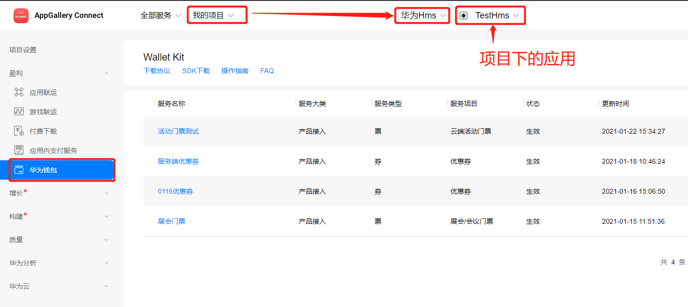
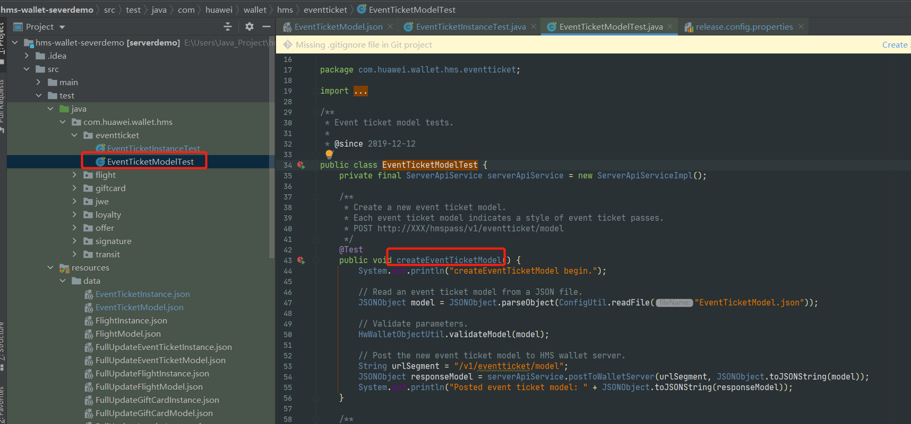

# 卡券功能使用
[**官方Demo地址**](https://github.com/HMS-Core/hms-wallet-clientdemo-android)

**1.当前项目介绍：**
* 使用两种方式推送卡券都需要后台代码配合：
  * 一、卡券包方式推送卡券：需要后台的`生成卡券包DEMO`-[hms-wallet-passgenerator][hms-wallet-passgenerator]生成卡券包数据`xxx.hwpass`文件。
  * 二、JWE方式推送卡券：需要后台的`推送卡券模板DEMO`-[hms-wallet-severdemo][hms-wallet-severdemo]在华为服务器生成卡券模板。
* 当前卡券只是在`华为钱包服务器`生成了一个卡券数据，可用在`华为钱包APP`里面查看，并没有卡券的NFC功能

**2.在上面的基础上给卡券添加`NFC功能`**
(待完成🥚)
* 👉 [nfc-文档][nfc-文档]
* 👉 [nfc-android-api][WalletPassApi-nfc]
* 👉 [华为开发者联盟][华为开发者联盟]

### 一.优惠券功能使用

`现在的卡券唯一标识已经到了：EventTicketPass100016之后测试会增加，如果要测试设置一个大位数`

> 此功能使用说明：当前操作是添加卡券到华为服务器，华为钱包显示会显示服务器的数据。  
> 只是一条卡券数据，并非生成真实的可用的NFC卡。

使用步骤：
* 0.在[`华为开发者联盟`][develop_web]注册应用，并创建`华为钱包服务-云侧接入`
    
* 1.使用`hms-wallet-severdemo`在`华为服务器`创建`卡券模板`
    
* 2.修改Android项目：
  * 修改`app/build.gradle`里面的`applicationId`为：上面创建的应用包名
  * 修改`Constant`里面的`PRIVATE_KEY_RUSSIA_DEBUG`为上面创建的钱包服务的私钥
  * 修改`coupon_card_info.xml布局`文件中的：`issuerIdCoupon` 为：上面创建的应用的`APP ID`
  * 修改`coupon_card_info.xml布局`文件中的：`passStyleIdentifierCoupon` 为：上面创建的卡券模板的`passStyleIdentifier-模板id`
  * 修改`coupon_card_info.xml布局`文件中的：`typeIdentifierCoupon` 为：上面创建的钱包服务的`passTypeIdentifier-钱包服务id`
* 2.1Android项目其他修改：
  * 签名jks配置-和开发者后台配置一致
  * 引入`agcp`依赖以及`agcp配置json`
* 3.运行Android项目，进入APP点击`JWE添加卡券方式`-`添加优惠券`-`修改卡券唯一标识,保证当前编号没有被添加过`-`walletKitSDK添卡`即可添加到钱包。

[develop_web]:https://developer.huawei.com/consumer/cn/
[hms-wallet-severdemo]:https://github.com/yueyue10/hms-wallet-severdemo
[hms-wallet-passgenerator]:https://github.com/HMS-Core/hms-wallet-passgenerator
[nfc-文档]:https://developer.huawei.com/consumer/cn/doc/development/HMSCore-Guides/access-overa-nfc-0000001050042374
[WalletPassApi-nfc]:https://developer.huawei.com/consumer/cn/doc/development/HMSCore-References-V5/api-hw-passsdk-walletpassapi-0000001050986379-V5
[华为开发者联盟]:https://developer.huawei.com/consumer/cn/console#/serviceCards/AppService